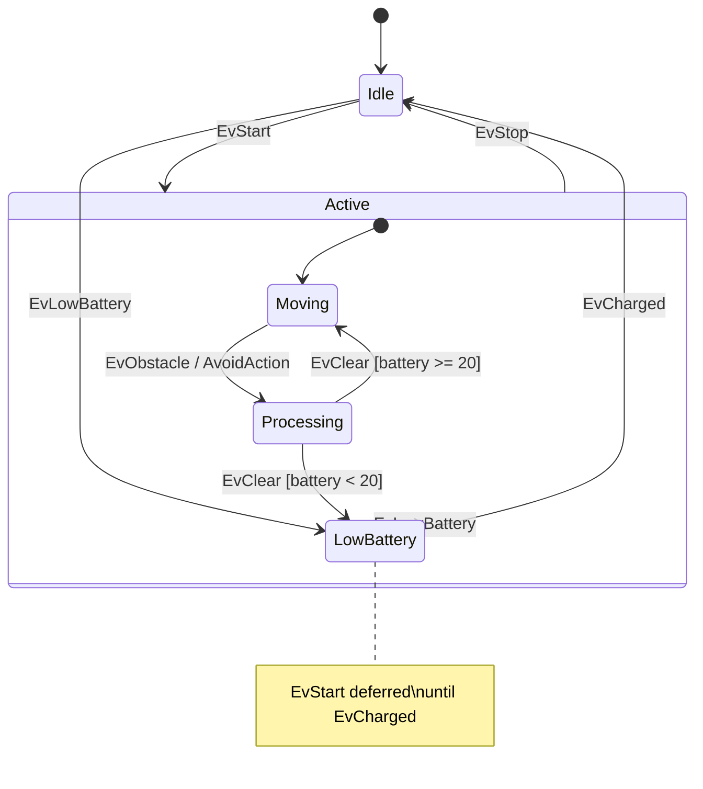

# 综合演示示例

## 说明

这个示例是一个**机器人控制系统**的综合演示，展示了 UFSM 框架的多个核心功能和高级特性，包括嵌套状态、事件转移、上下文访问、钩子函数、事件转发等。

## 功能概述

该示例模拟了一个机器人系统，机器人有多个运行状态（待命、运动、处理、电池低），可以接收各种命令事件并进行相应的状态转移和处理。

## 状态结构（完整层级）

```
Robot（状态机根）
├── Idle（初始状态）
│   响应：EvStart → Active
│   响应：EvLowBattery → LowBattery
│
├── Active（复合状态，初始=Moving）
│   响应：EvStop → Idle
│   响应：EvLowBattery → LowBattery
│   ├── Moving（子状态）
│   │   响应：EvObstacle → Processing（带 AvoidAction）
│   │
│   └── Processing（子状态）
│       响应：EvClear → Moving（如果 battery >= 20）
│       响应：EvClear → LowBattery（如果 battery < 20）
│
└── LowBattery（恢复状态）
    响应：EvCharged → Idle
    延迟：EvStart（等待充电完毕后自动处理）
```

## 状态机图（Mermaid）



## 支持的事件

| 事件 | 说明 |
|------|------|
| `EvStart` | 启动机器人 |
| `EvStop` | 停止机器人 |
| `EvObstacle` | 检测到障碍物 |
| `EvClear` | 障碍物已清除 |
| `EvLowBattery` | 电量不足 |
| `EvCharged` | 电量已充满 |
| `EvPing` | 测试事件（未处理） |

## 核心概念展示

### 1. **事件定义**
- 使用 `FSM_EVENT` 宏定义各种事件（EvStart、EvStop、EvObstacle、EvClear、EvLowBattery、EvCharged、EvPing）

### 2. **嵌套状态结构**
- Robot 状态机包含 3 个顶层状态：Idle、Active、LowBattery
- Active 是复合状态，包含两个子状态：Moving 和 Processing
- 初始状态链：Robot → Idle（然后通过事件进入其他状态）

### 3. **跨层转移**
- 父状态 Active 定义的转移（EvStop、EvLowBattery）对所有子状态有效
- 子状态可以触发的转移会覆盖父状态的同名转移

### 4. **带条件的转移（Guard）**
- Processing 的 EvClear 处理中，根据电量决定转移目标：
  - `if (battery >= 20)` → 转移到 Moving
  - `else` → 转移到 LowBattery

### 5. **转移动作（Action）**
- Moving → Processing 的转移带有 AvoidAction 动作，在转移时自动执行

### 6. **上下文管理**
- Robot 包含 `battery_level` 属性，所有状态都可访问和修改
- Processing 的事件处理中访问并修改了电池电量

### 7. **钩子函数**
- `OnUnhandledEvent()`：当事件无处理时调用（演示 EvPing 的未处理）
- `OnEventProcessed()`：每个事件处理后调用，用于追踪转移过程

### 8. **事件延迟（Deferral）**
- LowBattery 状态延迟 EvStart 事件
- 当转移到 Idle 时，被延迟的 EvStart 自动被处理

### 9. **状态进入/退出代码**
- 每个状态的构造函数执行进入逻辑（打印日志）
- 每个状态的析构函数执行退出逻辑（打印日志）

## 执行演示流程

程序主函数依次演示以下场景：

1. **正常启动流程**：Idle → Active → Moving
   - 发送 EvStart 事件，机器人从待命状态激活

2. **障碍物检测与转移**：Moving → Processing（带 action）
   - 发送 EvObstacle 事件，触发 AvoidAction（打印"启动避障协议"）
   - 状态转移到 Processing

3. **自定义逻辑与上下文访问**：Processing → Moving
   - 发送 EvClear 事件
   - Processing 的 React 方法：
     - 访问 Robot 的 battery_level 并减 5
     - 检查电量是否充足（>= 20）
     - 若充足，转移到 Moving；否则转移到 LowBattery

4. **层级转移（Drill-up）**：Moving → Active → Idle
   - 发送 EvStop 事件
   - Active 状态处理该事件，转移回 Idle

5. **电池不足**：Idle → LowBattery
   - 发送 EvLowBattery 事件，进入恢复状态

6. **事件延迟演示**：
   - 在 LowBattery 状态发送 EvStart，该事件被延迟（不立即处理）
   - 发送 EvCharged 事件，转移回 Idle
   - **自动处理**：被延迟的 EvStart 事件自动被处理，Idle → Active → Moving

7. **未处理事件钩子**：
   - 在 Idle 或 Moving 状态发送 EvPing
   - 钩子函数 OnUnhandledEvent 被调用并打印警告

## 编译与运行

```bash
cd /home/shawn/CLionProjects/ufsm/build
cmake ..
make example-comprehensive
./bin/example-comprehensive
```

## 输出示例

程序运行时会输出：
- 各状态的进入/退出日志
- 各转移的动作执行日志
- 事件处理追踪（通过 OnEventProcessed 钩子）
- 未处理事件的警告（通过 OnUnhandledEvent 钩子）

## 文件说明

- `main.cc`：完整的状态机定义和演示代码，包含：
  - 事件定义（第 1 部分）
  - 状态机定义及钩子函数（第 3 部分）
  - 各状态的定义及转移规则（第 4 部分）
  - 演示序列的主函数（第 5 部分）

## 学习要点

1. **嵌套状态结构**：Active 是复合状态，包含 Moving 和 Processing 子状态
2. **跨层转移**：父状态的转移对所有子状态生效，子状态转移可覆盖父状态的同名转移
3. **带条件转移（Guard）**：根据上下文数据进行条件判断，选择不同的转移目标
4. **转移动作（Action）**：在转移时执行自定义的操作
5. **事件延迟（Deferral）**：在特定状态延迟事件，待条件满足后自动处理
6. **钩子函数**：用于追踪事件处理过程和捕获未处理的事件
7. **上下文访问**：状态可直接访问和修改状态机的共享数据
