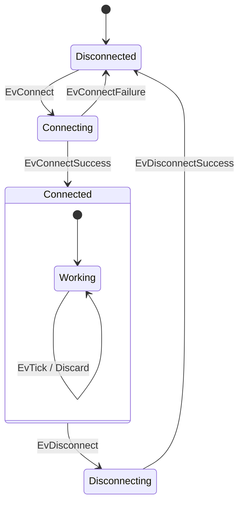

# Connector 示例

## 说明

这个示例演示了一个**连接器状态机**的实现，它展示了有限状态机在网络连接场景中的应用。

## 功能概述

该示例实现了一个具有以下状态的状态机：

- **Disconnected（断开连接）**：初始状态，等待连接请求
- **Connecting（正在连接）**：处于连接过程中，可以接收成功或失败的事件
- **Connected（已连接）**：连接已建立
  - **Working（工作中）**：处理各种工作事件（嵌套状态）
- **Disconnecting（正在断开）**：处于断开连接的过程中

## 状态机图（Mermaid）



## 支持的事件

| 事件 | 说明 |
|------|------|
| `EvConnect` | 请求连接 |
| `EvConnectSuccess` | 连接成功 |
| `EvConnectFailure` | 连接失败 |
| `EvDisconnect` | 请求断开连接 |
| `EvDisconnectSuccess` | 断开连接成功 |
| `EvTick` | 工作心跳事件 |

## 核心概念展示

- **状态转换**：展示从一个状态到另一个状态的转移逻辑
- **嵌套状态**：`Working` 是 `Connected` 的子状态
- **事件反应**：每个状态定义其能处理的事件类型
- **交互式命令处理**：通过命令行接收用户输入并处理相应事件

## 编译与运行

```bash
cd /home/shawn/CLionProjects/ufsm/build
cmake ..
make example-connector
./bin/example-connector
```

## 使用方式

程序启动后，根据提示输入命令：

```
$ connect                 # 发送EvConnect事件
$ connect_success        # 发送EvConnectSuccess事件
$ connect_failure        # 发送EvConnectFailure事件
$ tick                   # 发送EvTick事件（工作状态）
$ disconnect             # 发送EvDisconnect事件
$ disconnect_success    # 发送EvDisconnectSuccess事件
```

## 文件说明

- `connector_state_machine.h`：定义状态机结构和各个状态
- `connector.cc`：主程序，创建状态机实例并处理用户命令
