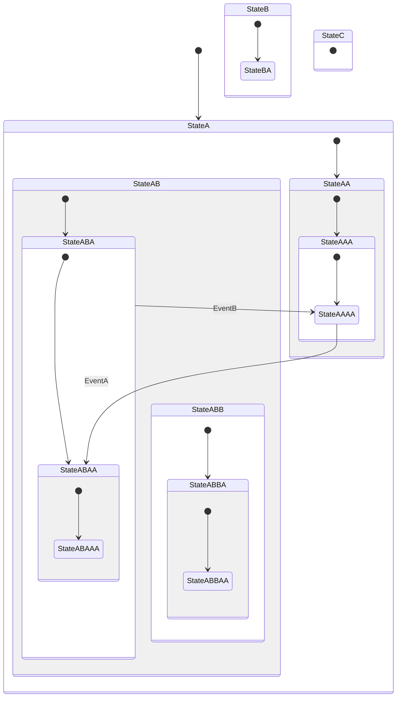

# 多层状态转移示例

## 说明

这个示例演示了**深层嵌套状态机**的实现，展示了包含多层次子状态的复杂状态结构及其转移逻辑。

## 功能概述

该示例实现了一个具有 3 层以上嵌套的状态机，展示如何在深层嵌套子状态之间进行转移、如何访问共享上下文，以及如何使用转移动作。

## 状态结构（完整层级）

**初始状态链：** Machine → StateA → StateAA → StateAAA → StateAAAA

```
Machine (根状态机，初始状态=StateA)
├── StateA (初始状态，初始子状态=StateAA)
│   ├── StateAA (初始子状态=StateAAA)
│   │   └── StateAAA (初始子状态=StateAAAA)
│   │       └── StateAAAA (叶子状态)
│   │           响应 EventA → Transit<StateABAA>
│   │           响应 EventB → DiscardEvent
│   │
│   └── StateAB (初始子状态=StateABA)
│       ├── StateABA (初始子状态=StateABAA)
│       │   │   响应 EventB → Transit<StateAAAA>
│       │   └── StateABAA (初始子状态=StateABAAA)
│       │       └── StateABAAA (叶子状态)
│       │
│       └── StateABB (初始子状态=StateABBA)
│           └── StateABBA (初始子状态=StateABBAA)
│               └── StateABBAA (叶子状态)
│
├── StateB (初始子状态=StateBA，示例未触达)
│   └── StateBA (叶子状态，注意：代码中 parent=Machine)
│
└── StateC (叶子状态，示例未触达)
```

## 状态机图（Mermaid）



## 支持的事件

| 事件 | 触发位置 | 结果 |
|------|---------|------|
| `EventA` | StateAAAA | 转移至 StateABAA（执行 action 修改 StateA 上下文） |
| `EventB` | StateABA | 转移至 StateAAAA（执行 action 修改 StateA 上下文） |
| `EventC` | 主程序发送 | 当前状态无响应处理 |
| `EventD` | 主程序发送 | 当前状态无响应处理 |

## 核心概念展示

- **深层嵌套状态**：演示 4-5 层的状态嵌套结构
- **跨层转移**：StateAAAA（第 4 层）直接转移到 StateABAA（同层），展示层级间的转移
- **状态上下文访问**：在转移 action 中访问共享的 StateA 上下文数据
- **转移 action**：使用 lambda 函数在转移时执行自定义逻辑
- **兄弟状态**：展示同一父状态下的多个子状态（StateAA 和 StateAB 是 StateA 的子状态；StateABA 和 StateABB 是 StateAB 的子状态）
- **状态生命周期**：展示初始化（Initiate）和终止（Terminate）过程

## 编译与运行

```bash
cd /home/shawn/CLionProjects/ufsm/build
cmake ..
make example-multi_layer_state
./bin/example-multi_layer_state
```

## 执行流程

1. **初始化**：Machine → StateA → StateAA → StateAAA → StateAAAA（进入最深层的叶子状态）
2. **EventA 处理**：在 StateAAAA 接收，执行 action 后转移到 StateABAA
   - action 执行：修改 StateA 的上下文变量 `state_a_context_string`
   - 状态链变为：StateA → StateAB → StateABA → StateABAA → StateABAAA
3. **EventB 处理**：在 StateABA 处理，执行 action 后转移回 StateAAAA
   - action 执行：再次修改 StateA 的上下文变量
   - 状态链变为：StateA → StateAA → StateAAA → StateAAAA
4. **EventC 处理**：发送但当前状态无处理，事件被丢弃
5. **EventD 处理**：发送但当前状态无处理，事件被丢弃
6. **重新初始化**：将状态机重置为初始状态链
7. **终止**：清理状态机资源

## 文件说明

- `machine.h`：定义事件类型和状态机基础结构
- `StateA.h`：定义 StateA 及其完整的嵌套子状态树（StateAA、StateAAA 等）
  - 包含转移反应（EventA 和 EventB 的处理）
  - 包含转移 action（修改共享上下文）
- `StateB.h`：定义 StateB 及其初始子状态 StateBA（示例未使用）
- `StateC.h`：定义 StateC（叶子状态，示例未使用）
- `main.cc`：主程序，依次发送各事件并演示状态转移
